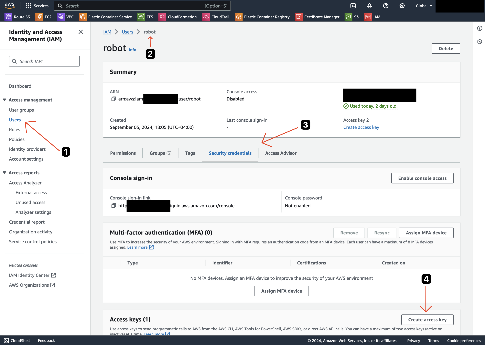

# s3archiver
Command-line tool for easy S3 backup management.

## Problem
Although AWS S3 is available through web interface its usage is fairly limited (e.g. it does not support files >160GB).
This tool uses Python AWS SKD, so it doesn't have this limitation as well as it provides some additional features.

## Features

1. Parallel upload (up to 10 threads)
2. Deep archive ([pricing](https://aws.amazon.com/s3/pricing/))
3. Unarchive (request restoration from Deep Archive/Glacier and copy when the restoration is done)
4. Cross-account copy (no need to download entire archive to local when moving to a new AWS account)

## Setup

### AWS

#### Usage scenario 1: Simple backup

When you use archive.py script then it uploads files to S3 and sets storage class *GLACIER* for all uploaded objects.

*See also [Amazon S3 Storage Classes](https://aws.amazon.com/s3/storage-classes/) and [boto3 documentation](https://boto3.amazonaws.com/v1/documentation/api/latest/reference/services/s3/client/put_object.html) for more information about storage classes on S3*

1. Create an S3 bucket in desired region. **Note!** All buckets across all accounts and AZs should have a unique name, but for purposes of this tutorial we're going to use `my-backup-files` as a bucket name
2. Create an IAM user (as opposed to root user) in your AWS account and give it permissions for your S3 bucket. For purposes of this tutorial we're going to call it `robot`. **Note!** Although you can attach polices directly to IAM users it's not a best practice. Attach polices to the User Groups and then add users to those groups instead.
```json
{
    "Version": "2012-10-17",
    "Statement": [
        {
            "Effect": "Allow",
            "Action": "s3:ListAllMyBuckets",
            "Resource": "*"
        },
        {
            "Effect": "Allow",
            "Action": [
                "s3:ListBucket",
                "s3:GetBucketLocation"
            ],
            "Resource": "arn:aws:s3:::my-backup-files"
        },
        {
            "Effect": "Allow",
            "Action": [
                "s3:GetObject",
                "s3:PutObject",
                "s3:DeleteObject"
            ],
            "Resource": "arn:aws:s3:::my-backup-files/*"
        }
    ]
}
```

Get AWS access key for the user



Make sure you saved both **Access key** and **Secret access key** because those values are going to be shown only once.


#### Usage Scenario 2: Cross-Account copy

Given you already have an S3 bucket in Glacier or Deep Archive. When you use archive_copy.py script then it copies files *directly* to a new bucket. No traffic goes to your local machine!

1. Provide a trust relationship between **Destination Account (D-Account)** and **Source Account (S-Account)**.
   1. In **S-Account** crate a policy called `read-write-app-bucket` that allows access to the *Source Bucket*. (see examples below)
   2. In **S-Account** create a role called `ReadData` that later can be assumed by `robot` user in **D-Account**. In the navigation pane, choose Roles and then choose Create role. 
   3. Choose the `An AWS account` role type. 
   4. For **Account ID**, type the **D-Account** account ID.
2. Set up a `robot` user in **D-Account** with proper access to the **Destination S3 Bucket** (see Scenario 1)
3. In **D-Account** create a policy `allow-assume-S3-role-in-source` and attach that to the `robot` user. (see examples below)
4. Add a *Bucket Policy* to `my-backup-files` S3 bucket. (see examples below)

##### Example of `read-write-app-bucket` policy:
```json
{
  "Version": "2012-10-17",
  "Statement": [
    {
      "Effect": "Allow",
      "Action": "s3:ListAllMyBuckets",
      "Resource": "*"
    },
    {
      "Effect": "Allow",
      "Action": [
        "s3:ListBucket",
        "s3:GetBucketLocation"
       ],
      "Resource": "arn:aws:s3:::old-archive"
    },
    {
      "Effect": "Allow",
      "Action": [
        "s3:GetObject",
        "s3:PutObject",
        "s3:DeleteObject"
      ],
      "Resource": "arn:aws:s3:::old-archive/*"
    }
  ]
}
```

##### Example of `allow-assume-S3-role-in-source` policy:
```json
{
    "Version": "2012-10-17",
    "Statement": {
        "Effect": "Allow",
        "Action": "sts:AssumeRole",
        "Resource": "arn:aws:iam::S-ACCOUNT_ID:role/ReadData"
    }
}
```

##### Example of a Bucket Policy:
```json
{
    "Version": "2012-10-17",
    "Statement": [
        {
            "Effect": "Allow",
            "Principal": {
                "AWS": "arn:aws:iam::S-ACCOUNT_ID:role/ReadData"
            },
            "Action": [
                "s3:PutObject",
                "s3:ListMultipartUploadParts",
                "s3:AbortMultipartUpload"
            ],
            "Resource": "arn:aws:s3:::my-backup-files/*"
        }
    ]
}
```

Why Bucket Policy Matters:
* Bucket policies are evaluated in addition to the permissions of the role or user trying to access the bucket.
* Even if your assumed role in Account B has the s3:PutObject and related permissions, the bucket policy acts as an extra layer of security. **If the bucket policy restricts access (or is too restrictive), it will block the operation, regardless of role permissions.**

[Read more about cross-account access management](https://docs.aws.amazon.com/IAM/latest/UserGuide/tutorial_cross-account-with-roles.html)

### Local

```bash
# check current python version. should be 3.10 or higher
python --version
```

Install [Pipenv](https://pipenv.pypa.io/en/latest/installation.html):

```bash
# install latest version
pip install --user --upgrade pipenv
```

```bash
git clone git@github.com:hex22a/s3archiver.git && cd s3archiver
```

```bash
# install dependencies with Pipenv
pipenv install
```

Follow [the instructions](https://docs.aws.amazon.com/cli/latest/userguide/getting-started-install.html) to get latest AWS CLI for your OS

Configure AWS CLI and use **Access key** and **Secret access key** from the steps above. Pay attention to the default region setting. This should match your AWS bucket region.

```bash
aws configure
```

Check aws configuration. The following command should output ARN for the `robot` user:

```bash
aws sts get-caller-identity
```


**For Scenario 2 Only!** Add `source_archive_profile` profile to your `~/.aws/config`. It should look somewhat like this:

```
[default]
region = us-east-1
output = json

[profile source_archive_profile]
region = us-east-1
role_arn=arn:aws:iam::SOURCE_ACCOUNT_ID:role/ReadData
source_profile=default
```

## Usage

Once You've done all that You can use the following scripts:

```bash
# Scenario 1
pipenv run python ./archive.py <folder> <bucket> <prefix>
```

Where `<folder>` is a path to your files on your local machine, `<bucket>` is an AWS S3 Bucket name and `<prefix>` is an optional parameter for the upload. Learn more about how to organize objects in your bucket using prefixes [here](https://docs.aws.amazon.com/AmazonS3/latest/userguide/using-prefixes.html)

```bash
# Scenario 2
pipenv run python ./archive_copy.py [-h] [-f] <source_s3_bucket> <destination_s3_bucket>
```